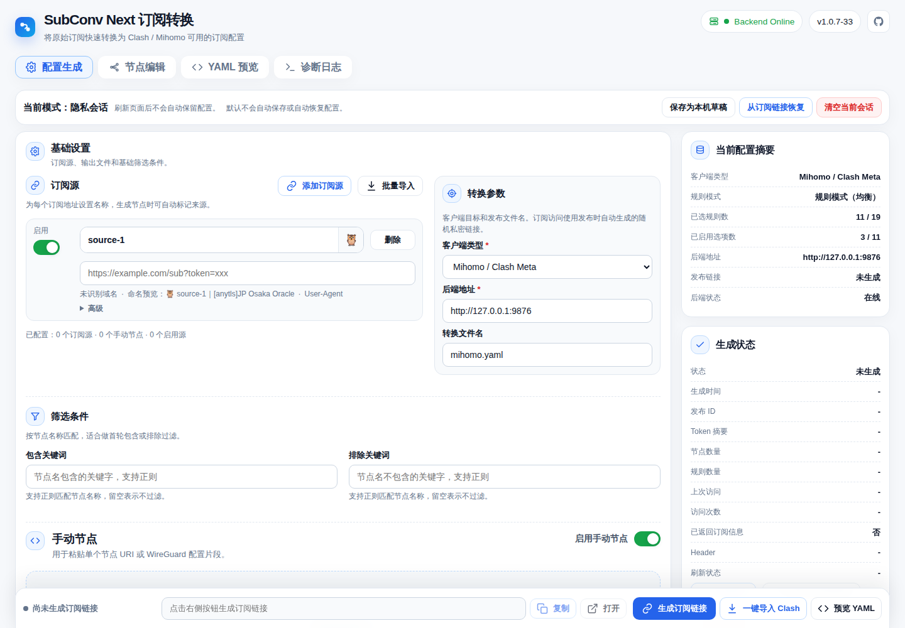

# SubConv Next

## 项目简介

SubConv Next 是面向 Mihomo / Clash Meta 的现代订阅转换工具。它以单个 Go 二进制提供内置 Web UI，用于聚合上游订阅、编辑节点、生成 Mihomo YAML，并发布随机私密订阅链接。

V1 重点面向自托管部署：Docker 运行形态、OpenWrt / Kwrt all-in-one IPK、订阅流量信息响应头、更安全的最终 YAML 校验，以及本地优先的 workspace 行为。

## 功能特性

- 支持多订阅源聚合，每个订阅源可设置名称和 Emoji。
- 节点名保留上游 raw name，只在前面添加 `Emoji + sourceName` 前缀；重复最终名称追加 `#2`、`#3`。
- 支持节点编辑、禁用、删除、恢复、批量改名和手动节点。
- 生成 Mihomo / Clash Meta YAML，支持规则策略组、分流组 full 模式节点列表，不生成国家 / 地区策略组。
- 聚合上游 `Subscription-Userinfo`，让 Clash / Mihomo 显示流量用量和到期时间。
- 使用 `/s/{token}/mihomo.yaml` 随机私密订阅链接。
- 支持本机浏览器草稿，且不保存完整发布 token。
- 最终 YAML 校验覆盖 proxy-group 引用、过滤节点、自动选择组内容和 `MATCH` 顺序。
- Docker 镜像支持 `/data` 持久化，以及 `linux/amd64`、`linux/arm64`。
- OpenWrt / Kwrt all-in-one IPK 包含后端服务、init.d、UCI 配置、procd、数据目录、LuCI 菜单和 LuCI 管理页。

支持协议包括 `ss`、`ssr`、`vmess`、`vless`、`trojan`、`hysteria2`、`tuic`、`anytls` 和 `wireguard`。其中 `anytls` 和 `wireguard` 在 V1 中仍按实验性支持处理。

## Screenshots

| Web UI |
|---|
|  |

## 快速开始

### Docker Compose

创建 `docker-compose.yml`：

```yaml
services:
  subconv-next:
    image: ghcr.io/earl9/subconv-next:latest
    container_name: subconv-next
    restart: unless-stopped
    ports:
      - "9876:9876"
    volumes:
      - ./data:/data
    environment:
      SUBCONV_HOST: 0.0.0.0
      SUBCONV_PORT: 9876
      SUBCONV_DATA_DIR: /data
      SUBCONV_LOG_LEVEL: info
```

启动：

```sh
docker compose up -d
curl -fsS http://127.0.0.1:9876/healthz
```

打开：

```text
http://127.0.0.1:9876/
```

固定版本建议使用 `ghcr.io/earl9/subconv-next:v1.0.0`；跟随最新发布版可使用 `ghcr.io/earl9/subconv-next:latest`。

### OpenWrt / Kwrt

OpenWrt / Kwrt 支持以 all-in-one IPK 提供，当前目标为 `rockchip/armv8` / `aarch64_generic`。

```sh
opkg install /tmp/subconv-next_1.0.0-4_aarch64_generic.ipk
curl -fsS http://127.0.0.1:9876/healthz
```

安装路径：

```text
/usr/bin/subconv-next
/etc/init.d/subconv-next
/etc/config/subconv-next
/etc/subconv-next/data
/usr/share/luci/menu.d/luci-app-subconv-next.json
/usr/share/rpcd/acl.d/luci-app-subconv-next.json
/www/luci-static/resources/view/subconv-next/index.js
```

当 UCI `enabled=1` 时，安装后会自动 enable 并启动服务。LuCI 入口为 `Services / SubConv Next`。

## 下载

发布文件只放在 GitHub Release Assets，不提交到仓库：

- GitHub Releases: <https://github.com/Earl9/subconv-next/releases>
- `subconv-next-linux-amd64`
- `subconv-next-linux-arm64`
- `subconv-next_1.0.0-4_aarch64_generic.ipk`
- `checksums.txt`

## 安全说明

SubConv Next V1 没有内置登录。请在本机或可信局域网中运行；如果需要暴露到可信网络之外，必须放在 HTTPS、认证、反向代理、VPN 或等效访问控制之后。

私密订阅 URL 是 bearer link：任何持有 `/s/{token}/mihomo.yaml` 的人都可以获取生成的 YAML。如果链接泄露，请在 Web UI 中重新生成私密链接。

日志和 API 会尽量脱敏完整 token、上游 URL 密钥、password、uuid、private-key、pre-shared-key、`Authorization` 和 `Cookie`。安全边界和漏洞报告方式见 [SECURITY.md](SECURITY.md)。

## 文档

- [Docker 部署](docs/docker.md)
- [配置说明](docs/configuration.md)
- [故障排查](docs/troubleshooting.md)
- [发版检查清单](docs/release-checklist.md)
- [OpenWrt / Kwrt 构建和打包](docs/openwrt-build.md)
- [安全模型细节](docs/security.md)
- [OpenWrt 包说明](docs/03-openwrt-package.md)
- [LuCI 应用说明](docs/10-luci-app.md)

## 开发

需要 Go 1.22+。

```sh
go test ./...
go test -race ./...
go vet ./...
```

本地运行：

```sh
go run ./cmd/subconv-next serve \
  --host 127.0.0.1 \
  --port 9876 \
  --data-dir "$PWD/data" \
  --log-level info
```

构建二进制：

```sh
go build -o subconv-next ./cmd/subconv-next
```

## 许可证

SubConv Next 使用 MIT License 发布，详见 [LICENSE](LICENSE)。
