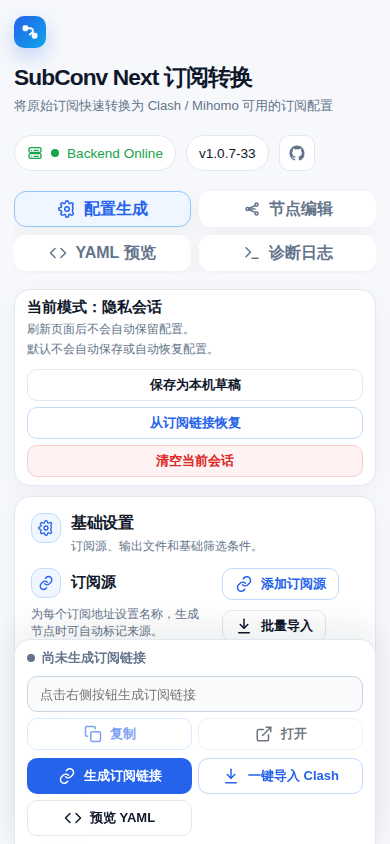
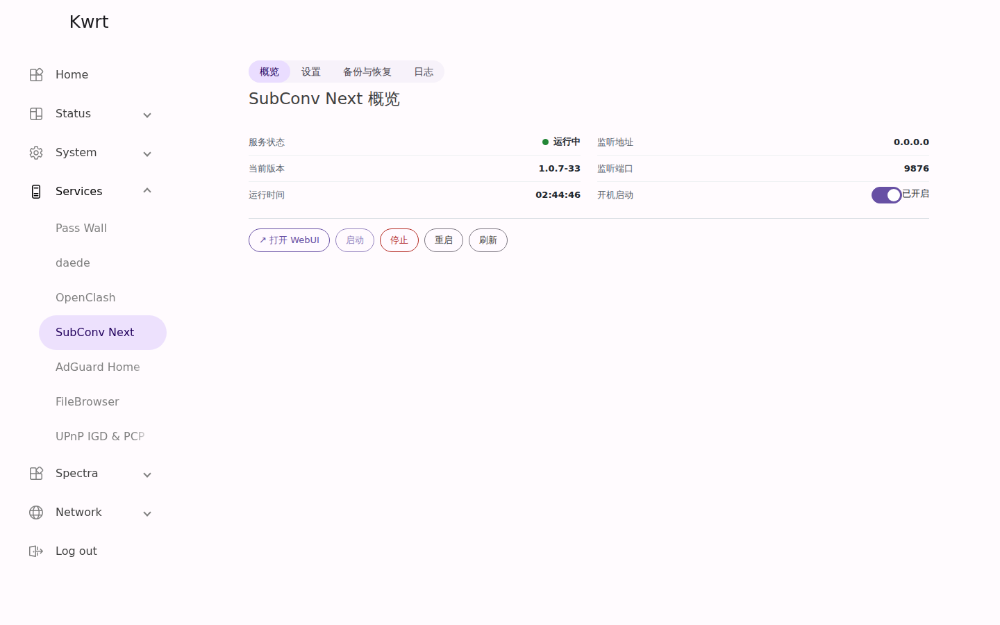
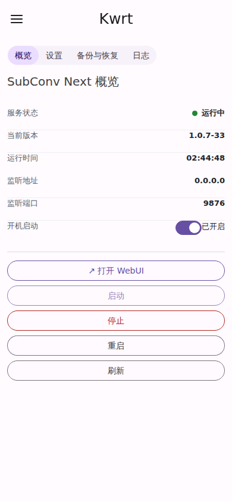

# SubConv Next

[English](README.md) | [简体中文](README.zh-CN.md)

SubConv Next 是面向 Mihomo / Clash Meta 的自托管订阅转换工具。单个 Go 二进制提供转换 API 和 Web UI，可聚合上游订阅、编辑节点、管理分流规则、生成经过校验的 Mihomo YAML，并发布随机私密订阅链接。

项目支持 Docker 部署，以及基于 procd、UCI、rpcd、ACL 和 LuCI JavaScript View 的原生 OpenWrt 集成。

## 功能特性

- 聚合多个订阅源，使用稳定来源 ID、名称和可选 Emoji 前缀。
- 解析 Base64 订阅、Clash/Mihomo YAML 和单节点 URI。
- 支持节点编辑、禁用、删除、恢复、批量改名和手动节点。
- 支持内置规则预设、自定义规则、远程规则集和自定义策略组。
- 可选生成国家组和国家自动测速组。
- 聚合上游 `Subscription-Userinfo`，展示流量用量和到期时间。
- 发布随机 `/s/{token}/mihomo.yaml` 私密订阅链接。
- 支持浏览器本机草稿，不保存完整发布 token。
- 输出前校验节点引用、规则集、策略组、过滤节点和最终 `MATCH` 顺序。
- Docker 支持 `linux/amd64`、`linux/arm64` 以及 `/config`、`/data` 持久化。
- 通过 LuCI 管理 OpenWrt 服务状态、设置、备份恢复和日志。

支持协议包括 `ss`、`ssr`、`vmess`、`vless`、`trojan`、`hysteria2`、`tuic`、`anytls`、`wireguard` 和 `mieru`。

## 截图

### Web UI


<details>
<summary>手机端 Web UI</summary>



</details>

### OpenWrt LuCI



<details>
<summary>手机端 LuCI</summary>



</details>

## 快速开始

### Docker Compose

创建 `docker-compose.yml`：

```yaml
services:
  subconv-next:
    image: ghcr.io/earl9/subconv-next:latest
    container_name: subconv-next
    restart: unless-stopped
    ports:
      - "9876:9876"
    volumes:
      - ./config:/config
      - ./data:/data
    environment:
      SUBCONV_HOST: 0.0.0.0
      SUBCONV_PORT: 9876
      SUBCONV_DATA_DIR: /data
      SUBCONV_LOG_LEVEL: info
```

启动并检查健康状态：

```sh
mkdir -p config data
docker compose up -d
curl -fsS http://127.0.0.1:9876/healthz
```

访问 <http://127.0.0.1:9876/>。

使用 `ghcr.io/earl9/subconv-next:latest` 跟随发布版本；需要可重复部署时请固定具体版本标签。

### OpenWrt / Kwrt

同时安装核心服务包和 LuCI 包：

```sh
opkg install \
  /tmp/subconv-next_<version>_aarch64_generic.ipk \
  /tmp/luci-app-subconv-next_<version>_all.ipk

ubus call luci.subconv status
curl -fsS http://127.0.0.1:9876/healthz
```

`aarch64_generic` 已在 Kwrt 25.12.2 `rockchip/armv8` 上验证。其它设备请先检查 `opkg print-architecture`。

主要安装路径：

```text
/usr/bin/subconv-next
/etc/init.d/subconv-next
/etc/config/subconv-next
/etc/subconv-next/data
/usr/libexec/rpcd/luci.subconv
/usr/share/luci/menu.d/luci-app-subconv-next.json
/usr/share/rpcd/acl.d/luci-app-subconv-next.json
/www/luci-static/resources/view/subconv-next/overview.js
```

当 UCI `enabled=1` 时，安装后会启用并启动服务。LuCI 入口为 **服务 > SubConv Next**。

## 下载

发布文件通过 [GitHub Releases](https://github.com/Earl9/subconv-next/releases) 提供，不提交到仓库。发布资产包括 Linux 二进制、OpenWrt IPK、LuCI 包和 `checksums.txt`。

## 安全说明

独立 Web UI 没有内置账户系统。请在本机或可信局域网中运行；需要对外开放时，应放在 HTTPS、认证反向代理、VPN 或等效访问控制之后。LuCI 使用路由器现有登录认证和 rpcd ACL 权限模型。

发布订阅 URL 是 bearer link。任何持有有效 `/s/{token}/mihomo.yaml` URL 的人都可以获取生成配置。链接泄露后请在 Web UI 中轮换。

日志和 API 会脱敏已知敏感字段，包括完整 token、上游 URL 凭据、密码、UUID、私钥、预共享密钥、`Authorization` 和 `Cookie`。安全模型和漏洞报告方式见 [SECURITY.md](SECURITY.md)。

## 文档

- [Docker 部署](docs/docker.md)
- [配置说明](docs/configuration.md)
- [故障排查](docs/troubleshooting.md)
- [发版检查清单](docs/release-checklist.md)
- [OpenWrt 构建和打包](docs/openwrt-build.md)
- [安全模型细节](docs/security.md)
- [OpenWrt 包说明](docs/03-openwrt-package.md)
- [LuCI 应用说明](docs/10-luci-app.md)

## 开发

需要 Go 1.22 或更高版本。

```sh
go test ./...
go test -race ./...
go vet ./...
```

本地运行：

```sh
go run ./cmd/subconv-next serve \
  --host 127.0.0.1 \
  --port 9876 \
  --data-dir "$PWD/data" \
  --log-level info
```

构建本地二进制：

```sh
go build -o subconv-next ./cmd/subconv-next
```

## 许可证

SubConv Next 使用 [MIT License](LICENSE) 发布。
